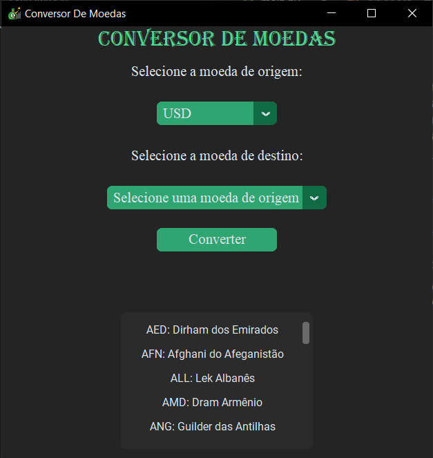

# Conversor de Moedas em Python

*É um programa que permite converter valores monetários de uma moeda para outra, utilizando taxas de câmbio atualizadas.*

## Funcionalidades:

- *Entrada de Dados: O usuário insere a moeda de origem e a moeda de destino.*
- *Obtenção da Taxa de Câmbio: O programa acessa uma API de taxas de câmbio atualizadas.*
- *Cálculo da Conversão: Utilizando a taxa de câmbio obtida, o programa calcula o valor convertido para a moeda escolhida.*
- *Exibição do Resultado: O Resultado da conversão é exposto na tela do usuário.*

## Instalação:
A Instalação deve seguir os seguintes passos:

## Pré-Requisitos:
*-Certifique que sua máquina tenha a versão do Python 3.12.3 instalada;*

*-Geralmente o pip vem instalado em conjunto ao Python, porém é importante verificar, para caso seja necessário fazer a Instalação.*

*-Se não tiver o Visual Studio Code instalado em sua máquina, instale-o.*

*-No Visual Studio Code, instale o as extensões: customtkinter, xmltodic e requests.*

## Screenshots:
!

## Aprendizado:
*Desenvolver esse projeto ofereceu ao nosso grupo várias oportunidades de aprendizado em diversas áreas de programação. Assim como aprofundamentos e aprendizagem em manusear vários sites e programas.*

## Autores:
*Carlos Eduardo  Escaramello Crivelaro*

*Raiany Mirella Miranda Oliveira*

*Raul Alves Batista*

*Vitor Hugo Camargo Senna*

